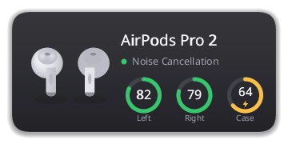
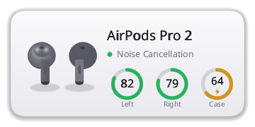

# podctl

Linux terminal control for AirPods. Battery, listening modes, conversation
awareness, ear detection, microphone selection, button mappings, audio
profile/codec/volume, Bluetooth lifecycle — all behind short commands.

```
podctl status                 full snapshot
podctl b                      battery
podctl m anc                  noise cancellation
podctl v 60                   volume 60 %
podctl watch                  live event stream
podctl debug                  paste-friendly diagnostic report
```

## Status

Daemon + CLI are wired end-to-end. The Apple Accessory Protocol channel
(L2CAP PSM 0x1001) is implemented from scratch — no external bluetooth
crate. Battery, in-ear detection, listening mode, conversation
awareness, AutoANC strength, one-bud-ANC and the mic-selection setting
are real on-device against AirPods Pro 2 USB-C. Audio (volume / mute /
profile / codec / default sink / latency) goes through PipeWire /
PulseAudio. BlueZ basics (list, connect, disconnect, pair, unpair,
trust) shell out to `bluetoothctl`; rename writes the BlueZ Alias
property via `dbus-send`.

Spatial audio, loud-sound reduction and the per-bud press-action /
tone-on-press configs are currently no-ops — their AAP setting IDs
aren't pinned down yet.

Two optional desktop components ship alongside the CLI:

- **`podctl-tray`** — a StatusNotifierItem that shows connection / battery
  state, a tooltip like `AirPods Pro 2 — L 84 % · R 81 % · Case 47 %`,
  and a quick-action menu (mode cycle, conversation awareness,
  disconnect). Works on Plasma, Hyprland/waybar, sway, Xfce, MATE; GNOME
  needs the AppIndicator extension.
- **`podctl-popup`** — the case-open bubble. Slides in at the bottom of
  the screen, shows model + L / R / Case rings, auto-hides after five
  seconds. Backend is auto-detected (wlr-layer-shell on Hyprland / KDE /
  sway / Wayfire, X11 override-redirect on i3 / Xfce / MATE, freedesktop
  Notification fallback on GNOME Wayland).

## Screenshots

`podctl-popup` rendered headlessly via `podctl-popup --dump`, so what you
see is the actual frame the compositor would draw.

| Dark | Light |
| --- | --- |
|  |  |

Tray screenshot pending — the icon and menu are live and tested on
Plasma + Hyprland/waybar, but a clean capture isn't in the repo yet.

## Quick start

```
git clone https://github.com/Rockykln/podctl && cd podctl
cargo build --release
./target/release/podctl install                       # core: CLI + daemon
./target/release/podctl install --with-tray --with-popup
```

`podctl install` puts the binaries in `~/.local/bin/`, drops completion in
the right place for your shell (bash/zsh/fish autodetected from `$SHELL`),
installs man pages, and asks whether you want a systemd user service that
keeps the daemon running. No root needed; `podctl uninstall` rolls it back.

If `~/.local/bin` isn't on your `$PATH`, the installer prints the line
your shell rc needs.

`podctl uninstall` also handles the AUR install: if the binary lives in
`/usr/bin/` it delegates to `sudo pacman -R podctl-bin` (or `podctl-git`)
after stopping the user services. Same exit point either way.

Per-distro dependencies and the desktop-compatibility matrix are in
[INSTALL.md](INSTALL.md).

## Daemon — optional

`podctl` is daemon-first but works without one. Every call tries the Unix
socket at `$XDG_RUNTIME_DIR/podctl.sock`; if the daemon's there, you get
fresh cached state. If not, the CLI falls back to running the audio +
Bluetooth operations in-process.

| Mode | What works | What needs the daemon |
| --- | --- | --- |
| Daemon up | Everything | — |
| Standalone | audio (volume / mute / profile / codec / default / latency), Bluetooth (list, connect, disconnect, pair, unpair, auto-connect, rename), `status` snapshot without live battery | `podctl watch`, live AAP state (battery, in-ear, mode echo), every AAP setter (mode, conv, mic, ear, one-bud-anc, auto-anc, chime) |

Skip the daemon on install: `podctl install --no-daemon`. Re-enable it
later by re-running `podctl install` (idempotent).

## Capabilities per model

| Feature | 1/2/3 | 4 | 4 ANC | Pro | Pro 2 | Pro 3 | Max |
| --- | :---: | :---: | :---: | :---: | :---: | :---: | :---: |
| Battery L / R / C | ✓ | ✓ | ✓ | ✓ | ✓ | ✓ | L / R |
| ANC / Transparency | — | — | ✓ | ✓ | ✓ | ✓ | ✓ |
| Adaptive | — | — | ✓ | — | ✓ | ✓ | — |
| Conversation Awareness | — | — | ✓ | — | ✓ | ✓ | — |
| In-Ear Detection | ✓ | ✓ | ✓ | ✓ | ✓ | ✓ | — |
| Loud-Sound Reduction | — | — | ✓ | — | ✓ | ✓ | ✓ |
| Spatial Audio | 3 / 4 | ✓ | ✓ | ✓ | ✓ | ✓ | ✓ |
| Press-and-Hold | — | — | ✓ | ✓ | ✓ | ✓ | ✓ |
| Microphone Selection | ✓ | ✓ | ✓ | ✓ | ✓ | ✓ | — |
| Rename | ✓ | ✓ | ✓ | ✓ | ✓ | ✓ | ✓ |

Source of truth for this matrix is `src/caps.rs::Model::capabilities`.
AirPods Max (2nd gen, `0x202D`) shares the original Max capability row.
AirPods 4 (non-ANC) currently has no publicly-known Bluetooth product
code — the bud still shows up via the BlueZ headphones icon but resolves
to `Unknown` until a capture lands.

`podctl` refuses commands the connected device can't do with a clear
`not supported on <model>` error rather than silently failing.

## Commands

```
podctl help                   top-level list
podctl help <cmd>             detailed page
podctl <cmd> --help           same
podctl --json <cmd>           machine-readable response (every command)
```

### Device

| Command | What it does |
| --- | --- |
| `podctl status` (`s`) | full snapshot |
| `podctl battery` (`b`) | battery levels |
| `podctl ping` | daemon health |

### Listening modes

| Command | What it does |
| --- | --- |
| `podctl mode <off\|anc\|transparency\|adaptive>` | switch noise-control |
| `podctl conv <on\|off>` | conversation awareness |
| `podctl spatial <off\|fixed\|head-tracked>` | spatial-audio mode |

### Bud settings

| Command | What it does |
| --- | --- |
| `podctl ear <on\|off>` | in-ear auto-pause detection |
| `podctl mic <auto\|left\|right>` | microphone selection |
| `podctl loud-reduction <on\|off>` | cap loud sound spikes (Pro / Pro 2) — *AAP id TBD* |
| `podctl press <left\|right> <mode-cycle\|siri\|none>` | stem long-press — *AAP id TBD* |
| `podctl tone <on\|off>` | acoustic feedback on press — *AAP id TBD* |
| `podctl rename "name"` | bluetooth name |
| `podctl one-bud-anc <on\|off>` | keep ANC active when only one bud is in |
| `podctl auto-anc <0..100>` | AutoANC / Adaptive Audio strength |
| `podctl chime <0..100>` | system tone / chime volume |

### Bluetooth

| Command | What it does |
| --- | --- |
| `podctl connect` / `podctl disconnect` (`dc`) | bring the link up/down |
| `podctl pair` / `podctl unpair` (`forget`) | BlueZ pairing |
| `podctl list` (`ls`) | paired AirPods on this adapter |
| `podctl auto-connect <on\|off>` | BlueZ trusted/auto-connect flag |

### Audio

| Command | What it does |
| --- | --- |
| `podctl volume <0..100>` (`v`) | audio sink volume |
| `podctl mute <on\|off>` | mute toggle |
| `podctl profile <high\|headset\|off>` (`p`) | audio profile |
| `podctl codec <sbc\|aac\|aptx\|ldac\|…>` | A2DP codec |
| `podctl default` | set as default sink |
| `podctl latency <ms>` | sink latency offset |

### Streaming + meta

| Command | What it does |
| --- | --- |
| `podctl watch` (`w`) | live event stream — Ctrl-C to stop |
| `podctl meter [--plain\|--json] [--interval N]` | live RMS / peak dBFS of audio going to the buds (software meter, not SPL) |
| `podctl completion <bash\|zsh\|fish>` | emit completion script |
| `podctl debug [--no-redact]` | diagnostic report (DSGVO-redacted by default) |
| `podctl tray <start\|stop\|status\|restart>` | status-bar icon (podctl-tray) |
| `podctl popup` | show the case-open bubble now (podctl-popup) |
| `podctl reboot` | restart podctld + tray + popup |
| `podctl install [--with-tray] [--with-popup]` / `podctl uninstall` | installer / rollback |
| `podctl version` (`-V`) | CLI + daemon version |
| `podctl help [cmd]` | this list / detailed page |

## Debug reports — DSGVO-friendly

`podctl debug` is meant to be pasted into a bug report. Identifying data
is redacted by default:

- MAC addresses → only the Apple OUI (first three bytes) shown
- custom Bluetooth names → `<custom name redacted>` (default Apple
  names like "AirPods Pro" pass through)
- `$HOME` paths → `~`, `/run/user/<uid>` masked

Use `podctl debug --no-redact` for local diagnostics only.

## How it talks to the AirPods

Apple's BLE manufacturer-data prefix (`0x4C 0x00 0x07 0x19 …`) carries
proximity-pair info — the bytes that identify the model before any
classic-Bluetooth connection exists. Once connected, AirPods accept an
L2CAP `SeqPacket` socket on PSM `0x1001` (Apple Accessory Protocol).
Frames are:

```
04 00 04 00  <opcode>  <subop>  <payload …>
```

Battery, in-ear, button presses arrive unsolicited. Settings (mode,
conversation awareness, button mappings) are written by sending the
same families back. See `src/aap.rs` for the opcode table.

## Limitations (not Linux-fixable)

- **Find My** — Apple iCloud only
- **Personalized Spatial Audio** — proprietary HRTF
- **Hearing Test** — iOS-only flow
- **Announce Notifications via Siri** — needs Siri

The bud still accepts the underlying setting toggles, but the
rendering doesn't exist on Linux.

## Architecture

Four binaries linking one library crate.

```
src/
  caps.rs              per-model capability matrix
  model.rs             domain types
  ipc.rs               daemon ↔ cli wire types
  audio.rs             PipeWire/PulseAudio via pactl
  bluez.rs             BlueZ via bluetoothctl
  aap.rs               Apple Accessory Protocol
  l2cap.rs             raw AF_BLUETOOTH SEQPACKET socket
  exitcode.rs          BSD sysexits.h
  lib.rs               re-exports
  bin/
    podctl.rs            CLI entry
    podctld.rs           daemon entry
    help.rs            help text
    fmt.rs             output formatting
    completion.rs      shell completion emitter
    debug.rs           diagnostic report (`podctl debug`)
    install.rs         podctl install / uninstall
    meter.rs           podctl meter (parec wrapper)
    standalone.rs      no-daemon fallback dispatcher
    tray_cli.rs        podctl tray start/stop/status/restart wrapper
    daemon/
      mod.rs           request dispatch + state
      server.rs        Unix-socket accept loop
      link.rs          BlueZ + PipeWire poll loop
      aap.rs           L2CAP runtime + AAP frame pump
    tray/              podctl-tray binary (SNI + DBusMenu)
    popup/             podctl-popup binary (wlr-layer-shell / X11 / notify)
```

Wire format between CLI and daemon: newline-delimited JSON, one request
per line, one response per line. `watch` opens a long-lived subscription
that streams `Event`s.

## Roadmap

- [ ] AAP captures for spatial audio, loud-sound reduction, and the
      per-bud press-action / tone-on-press setting IDs (the three
      no-ops listed under Status)
- [ ] AAP captures from AirPods 4 ANC and AirPods Max to confirm the
      capability matrix beyond Pro 2 USB-C
- [ ] Distro packaging (AUR, deb, rpm)

## License

MIT OR Apache-2.0. See [LICENSE-MIT](LICENSE-MIT) and
[LICENSE-APACHE](LICENSE-APACHE).

Inspired by [LibrePods](https://github.com/kavishdevar/librepods) (GPL-3.0);
no GPL code is included.
